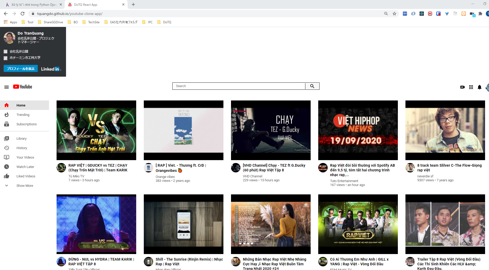
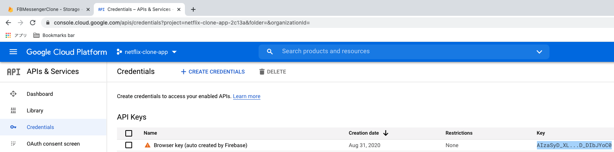

# react-youtube-clone-app 🚀

## deploy local
1. copy `.env.sample` to `.env`
2. `npm i`
3. `npm run start`

## REACT_APP_APIKEY
https://github.com/tquangdo/react-youtube-clone-app/blob/23229d6faf4e13f3fce48a9fe017017e37bc674a/.env.sample#L1
- -> need this key to call API: `src/utils/common/constant.js: YOUTUBE_SNIPPET_URL & YOUTUBE_STATIS_URL`
1. https://console.developers.google.com/apis/credentials
2. chọn project: TH này là "netflix-clone-app" (common use)
3. API Keys > Key=AIzaS...

